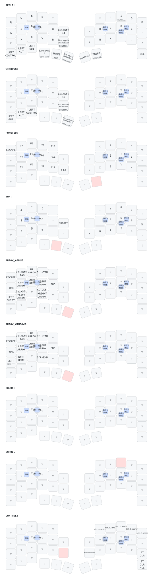

# zmk-config-roBa

roBa uses OS-specific base layers so that the same physical keys perform the
same operation on Apple devices and Windows. All connected devices are expected
to use a US keyboard layout.

## OS modes

Apple mode is the default after the keyboard starts. Selecting a Bluetooth
profile also selects its OS mode:

| Bluetooth profile | OS mode | Intended device |
| --- | --- | --- |
| 0 | Apple | Mac |
| 1 | Windows | Windows PC |
| 2 | Apple | iPad |
| 3 | Apple | iPhone |
| 4 | Apple | Additional Apple device |

The selected OS mode is not saved separately. When the keyboard reconnects to
BT1 after a power cycle, select BT1 again to restore Windows mode.

The three left modifier keys keep the primary shortcut modifier in the same
physical position:

| Position | Apple mode | Windows mode |
| --- | --- | --- |
| Left | Control | Win |
| Center | Command | Ctrl |
| Right | Option | Alt |

OS-specific shortcuts are normalized as follows:

| Operation | Apple mode | Windows mode |
| --- | --- | --- |
| Screenshot | Command+Shift+4 | Win+Shift+S |
| Select to start of line | Command+Shift+Left | Shift+Home |
| Select to end of line | Command+Shift+Right | Shift+End |

`LANGUAGE_1` and `LANGUAGE_2` continue to send their original HID keycodes.

## Hardware verification

After flashing both halves, verify the following on the actual devices:

- [ ] BT0 and BT2-4 select Apple mode; BT1 selects Windows mode.
- [ ] The center modifier produces Command on Apple and Ctrl on Windows.
- [ ] Screenshot produces the expected OS screenshot UI or capture.
- [ ] Arrow-layer selection extends to the start and end of a line.
- [ ] Function, Num, Apple/Windows Arrow, Mouse, and Scroll layers work.
- [ ] `LANGUAGE_1` and `LANGUAGE_2` retain their previous behavior.
- [ ] A power cycle starts in Apple mode.

## Keymap

